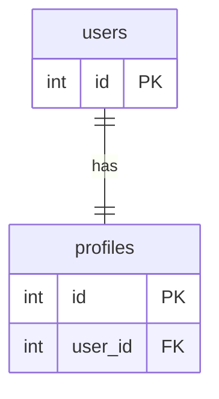
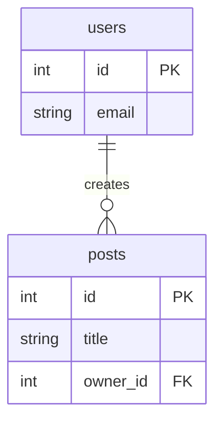
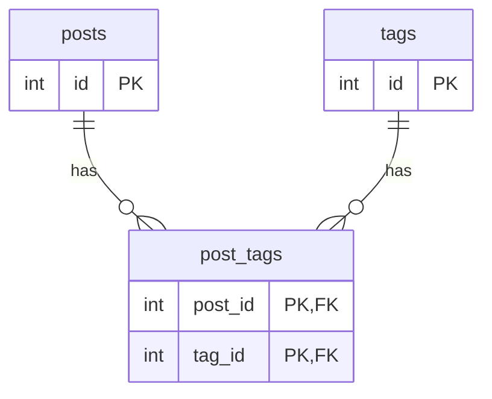
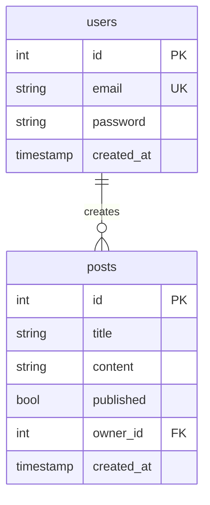

# Database Relationships

In a relational database, tables are linked to each other through **foreign keys**. SQLAlchemy mirrors these links
with a `ForeignKey` column and a `relationship()` attribute that lets you traverse the link in Python code.

1. [Types of database relationships](#1-types-of-database-relationships)
2. [The User → Posts relationship](#2-the-user--posts-relationship)
3. [Add the foreign key and relationship to the models](#3-add-the-foreign-key-and-relationship-to-the-models)
4. [Update the schemas](#4-update-the-schemas)
5. [Link posts to their owner on creation](#5-link-posts-to-their-owner-on-creation)
6. [Enforce ownership on update and delete](#6-enforce-ownership-on-update-and-delete)
7. [Full code](#7-full-code)

## 1. Types of database relationships

### One-to-one

One record in table A is related to exactly **one** record in table B.

**Example:** a user has exactly one profile.



### One-to-many

One record in table A is related to **many** records in table B. This is the most common relationship type.

**Example:** one user creates many posts.



### Many-to-many

Many records in table A can be related to many records in table B through a **junction (association) table**.

**Example:** a post can have many tags, and a tag can belong to many posts.



---

## 2. The User → Posts relationship

In this project we implement a **one-to-many** relationship: one `User` creates many `Posts`. Each post records
who created it via an `owner_id` foreign key column.



This relationship also enables **ownership enforcement**: only the user who created a post may update or delete it.

---

## 3. Add the foreign key and relationship to the models

`owner_id` is the foreign key column that stores which user created the post. `owner = relationship("User")` is not a
database column. SQLAlchemy uses it to load the related `User` when you access `post.owner`.

`ondelete="CASCADE"` deletes a user's posts when that user is deleted.

```python
from sqlalchemy import Boolean, Column, Integer, String, ForeignKey
from sqlalchemy.orm import relationship
from sqlalchemy.sql.expression import text
from sqlalchemy.sql.sqltypes import TIMESTAMP

from .database import Base


class Post(Base):
    # Define the table name
    __tablename__ = "posts"

    # Define all the fields/columns in the table
    id = Column(Integer, primary_key=True, nullable=False)
    title = Column(String, nullable=False)
    content = Column(String, nullable=False)
    published = Column(Boolean, server_default='true', nullable=False)
    created_at = Column(TIMESTAMP(timezone=True), nullable=False, server_default=text('now()'))
    # Define the relationship to the User model
    owner_id = Column(Integer, ForeignKey("users.id", ondelete="CASCADE"), nullable=False)

    # Define the relationship to the User model
    owner = relationship("User")

class User(Base):
    __tablename__ = "users"
    id = Column(Integer, primary_key=True, nullable=False)
    email = Column(String, nullable=False, unique=True)
    password = Column(String, nullable=False)
    created_at = Column(TIMESTAMP(timezone=True), nullable=False, server_default=text('now()'))
```

---

## 4. Update the schemas

`UserOut` is defined before `Post` because `Post.owner` references it. `owner_id` is the foreign key integer.
`owner` is the nested user loaded by the SQLAlchemy relationship. `UserOut` omits `password`.

`model_config = ConfigDict(from_attributes=True)` lets Pydantic read attributes off the SQLAlchemy model, including
the related `owner` object.

```python
class UserOut(BaseModel):
    id: int
    email: EmailStr
    created_at: datetime
    # This is used to convert the SQLAlchemy model to a Pydantic model
    model_config = ConfigDict(from_attributes=True)


class Post(PostBase):
    id: int
    created_at: datetime
    # This is the id of the user who created the post
    owner_id: int
    # This is the user who created the post
    owner: UserOut
    # This is used to convert the SQLAlchemy model to a Pydantic model
    model_config = ConfigDict(from_attributes=True)
```

---

## 5. Link posts to their owner on creation

To link posts to their owner on creation, we need to modify the `create_post` function.

```python
# 201 Created: this request created a new post.
@router.post("/", status_code=status.HTTP_201_CREATED, response_model=schemas.Post)
def create_post(post: schemas.PostCreate, db: Session = Depends(get_db),
                current_user: int = Depends(oauth2.get_current_user)):
    # Create a new post, owner_id is the id of the user who created the post
    new_post = models.Post(owner_id=current_user.id, **post.model_dump())
    # Add the new post to the database
    db.add(new_post)
    # Commit the changes to the database
    db.commit()
    # Refresh the new post to get the id
    db.refresh(new_post)
    # Return the new post
    return new_post
```

---

## 6. Enforce ownership on update and delete

To enforce ownership on update and delete, we need to modify the `update_post` and `delete_post` functions.

**update_post:**

```python
@router.put("/{id}", response_model=schemas.Post)
def update_post(id: int, post: schemas.PostCreate, db: Session = Depends(get_db),
                current_user: models.User = Depends(oauth2.get_current_user)):
    # Build the query once so we can reuse it
    post_query = db.query(models.Post).filter(models.Post.id == id)
    existing_post = post_query.first()
    # If the post is not found, raise a 404 error (before committing)
    if existing_post is None:
        raise HTTPException(status_code=status.HTTP_404_NOT_FOUND, detail=f"post with id: {id} was not found")
    # Make sure only the owner of the post can update it, otherwise raise a 403 error
    if existing_post.owner_id != current_user.id:
        raise HTTPException(status_code=status.HTTP_403_FORBIDDEN, detail="Not authorized to perform requested action")
    # Update the post in the database
    post_query.update(post.model_dump(), synchronize_session=False)
    # Commit the changes to the database
    db.commit()
    # Re-fetch and return the updated post (update() returns row count, not the object)
    return post_query.first()
```

**delete_post:**

```python
@router.delete("/{id}", status_code=status.HTTP_204_NO_CONTENT)
def delete_post(id: int, db: Session = Depends(get_db),
                current_user: models.User = Depends(oauth2.get_current_user)):
    # Build the query so we can reuse it for the existence and ownership checks
    post_query = db.query(models.Post).filter(models.Post.id == id)
    post = post_query.first()
    # If the post is not found, raise a 404 error
    if post is None:
        raise HTTPException(status_code=status.HTTP_404_NOT_FOUND, detail=f"post with id: {id} was not found")
    # Make sure only the owner of the post can delete it, otherwise raise a 403 error
    if post.owner_id != current_user.id:
        raise HTTPException(status_code=status.HTTP_403_FORBIDDEN, detail="Not authorized to perform requested action")
    # Delete the post from the database
    post_query.delete(synchronize_session=False)
    # Commit the changes to the database
    db.commit()
    # 204 No Content must return an empty body
    return Response(status_code=status.HTTP_204_NO_CONTENT)
```

---

## 7. Full code

The updated file architecture:

```text
app/
├── routers/
│   ├── auth.py         # Authentication router (POST /login)
│   ├── post.py         # Posts router (owner_id on create, ownership on update/delete)
│   ├── user.py         # Users router
│   └── __init__.py
├── main.py             # Registers all routers
├── database.py         # Database connection
├── models.py           # SQLAlchemy models (posts.owner_id foreign key and owner relationship)
├── oauth2.py           # JWT token logic and get_current_user dependency
├── schemas.py          # Pydantic schemas (Post includes owner_id and owner)
└── utils.py            # Password hashing utilities
```

**models.py:**

```python
from sqlalchemy import Boolean, Column, Integer, String, ForeignKey
from sqlalchemy.orm import relationship
from sqlalchemy.sql.expression import text
from sqlalchemy.sql.sqltypes import TIMESTAMP

from .database import Base


class Post(Base):
    # Define the table name
    __tablename__ = "posts"

    # Define all the fields/columns in the table
    id = Column(Integer, primary_key=True, nullable=False)
    title = Column(String, nullable=False)
    content = Column(String, nullable=False)
    published = Column(Boolean, server_default='true', nullable=False)
    created_at = Column(TIMESTAMP(timezone=True), nullable=False, server_default=text('now()'))
    # Define the relationship to the User model
    owner_id = Column(Integer, ForeignKey("users.id", ondelete="CASCADE"), nullable=False)

    # Define the relationship to the User model
    owner = relationship("User")

class User(Base):
    __tablename__ = "users"
    id = Column(Integer, primary_key=True, nullable=False)
    email = Column(String, nullable=False, unique=True)
    password = Column(String, nullable=False)
    created_at = Column(TIMESTAMP(timezone=True), nullable=False, server_default=text('now()'))
```

**schemas.py:**

```python
from typing import Optional
from pydantic import BaseModel, ConfigDict, EmailStr
from datetime import datetime


class PostBase(BaseModel):
    title: str
    content: str
    published: bool = True


class PostCreate(PostBase):
    # pass means that the class is empty and will be inherited from the PostBase class
    pass


class UserOut(BaseModel):
    id: int
    email: EmailStr
    created_at: datetime
    # This is used to convert the SQLAlchemy model to a Pydantic model
    model_config = ConfigDict(from_attributes=True)


class Post(PostBase):
    id: int
    created_at: datetime
    # This is the id of the user who created the post
    owner_id: int
    # This is the user who created the post
    owner: UserOut
    # This is used to convert the SQLAlchemy model to a Pydantic model
    model_config = ConfigDict(from_attributes=True)


class UserCreate(BaseModel):
    email: EmailStr
    password: str


class UserLogin(BaseModel):
    email: EmailStr
    password: str


class Token(BaseModel):
    access_token: str
    token_type: str


class TokenData(BaseModel):
    id: Optional[int] = None
```

**routers/post.py:**

```python
from fastapi import Depends, HTTPException, Response, status, APIRouter
from sqlalchemy.orm import Session

from app import models, schemas, oauth2
from app.database import get_db

router = APIRouter(
    prefix="/posts",
    tags=["Posts"]
)


@router.get("/", response_model=list[schemas.Post])
def get_posts(db: Session = Depends(get_db), current_user: models.User = Depends(oauth2.get_current_user)):
    # Get all posts from the database
    posts = db.query(models.Post).all()
    # Get all posts from the database for the current user
    # posts = db.query(models.Post).filter(models.Post.owner_id == current_user.id).all()
    # Return the posts
    return posts


# 201 Created: this request created a new post.
@router.post("/", status_code=status.HTTP_201_CREATED, response_model=schemas.Post)
def create_post(post: schemas.PostCreate, db: Session = Depends(get_db),
                current_user: int = Depends(oauth2.get_current_user)):
    # Create a new post, owner_id is the id of the user who created the post
    new_post = models.Post(owner_id=current_user.id, **post.model_dump())
    # Add the new post to the database
    db.add(new_post)
    # Commit the changes to the database
    db.commit()
    # Refresh the new post to get the id
    db.refresh(new_post)
    # Return the new post
    return new_post


# Register this before /posts/{id}, or FastAPI treats "latest" as an id.
@router.get("/latest", response_model=schemas.Post)
def get_latest_post(db: Session = Depends(get_db),
                    current_user: models.User = Depends(oauth2.get_current_user)):
    # Get the latest post from the database
    latest_post = db.query(models.Post).order_by(models.Post.id.desc()).first()
    # If no posts exist, raise a 404 error
    if latest_post is None:
        raise HTTPException(status_code=status.HTTP_404_NOT_FOUND, detail="No posts found")
    # Return the latest post
    return latest_post


@router.get("/{id}", response_model=schemas.Post)
def get_post(id: int, db: Session = Depends(get_db),
             current_user: models.User = Depends(oauth2.get_current_user)):
    # Get the post from the database by id
    post = db.query(models.Post).filter(models.Post.id == id).first()

    # If the post is not found, raise a 404 error
    if post is None:
        raise HTTPException(status_code=status.HTTP_404_NOT_FOUND, detail=f"post with id: {id} was not found")

    # Make sure the post belongs to the current user, otherwise raise a 403 error
    # if post.owner_id != current_user.id:
    #     raise HTTPException(status_code=status.HTTP_403_FORBIDDEN, detail="Not authorized to perform requested action")

    # Return the post
    return post


# 204 No Content: this request deleted a post.
@router.delete("/{id}", status_code=status.HTTP_204_NO_CONTENT)
def delete_post(id: int, db: Session = Depends(get_db),
                current_user: models.User = Depends(oauth2.get_current_user)):
    # Build the query so we can reuse it for the existence and ownership checks
    post_query = db.query(models.Post).filter(models.Post.id == id)
    post = post_query.first()
    # If the post is not found, raise a 404 error
    if post is None:
        raise HTTPException(status_code=status.HTTP_404_NOT_FOUND, detail=f"post with id: {id} was not found")
    # Make sure only the owner of the post can delete it, otherwise raise a 403 error
    if post.owner_id != current_user.id:
        raise HTTPException(status_code=status.HTTP_403_FORBIDDEN, detail="Not authorized to perform requested action")
    # Delete the post from the database
    post_query.delete(synchronize_session=False)
    # Commit the changes to the database
    db.commit()
    # 204 No Content must return an empty body
    return Response(status_code=status.HTTP_204_NO_CONTENT)


@router.put("/{id}", response_model=schemas.Post)
def update_post(id: int, post: schemas.PostCreate, db: Session = Depends(get_db),
                current_user: models.User = Depends(oauth2.get_current_user)):
    # Build the query once so we can reuse it
    post_query = db.query(models.Post).filter(models.Post.id == id)
    existing_post = post_query.first()
    # If the post is not found, raise a 404 error (before committing)
    if existing_post is None:
        raise HTTPException(status_code=status.HTTP_404_NOT_FOUND, detail=f"post with id: {id} was not found")
    # Make sure only the owner of the post can update it, otherwise raise a 403 error
    if existing_post.owner_id != current_user.id:
        raise HTTPException(status_code=status.HTTP_403_FORBIDDEN, detail="Not authorized to perform requested action")
    # Update the post in the database
    post_query.update(post.model_dump(), synchronize_session=False)
    # Commit the changes to the database
    db.commit()
    # Re-fetch and return the updated post (update() returns row count, not the object)
    return post_query.first()
```
