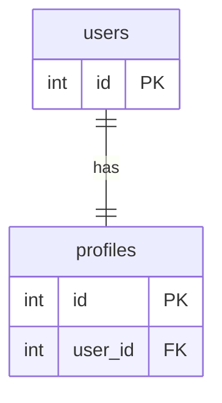
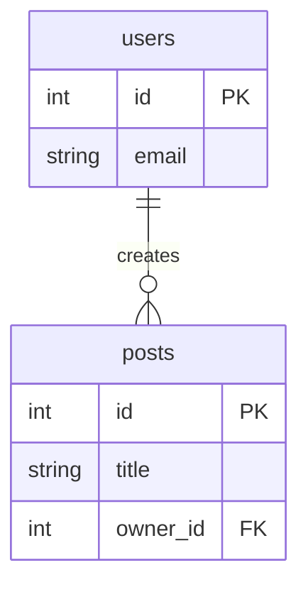
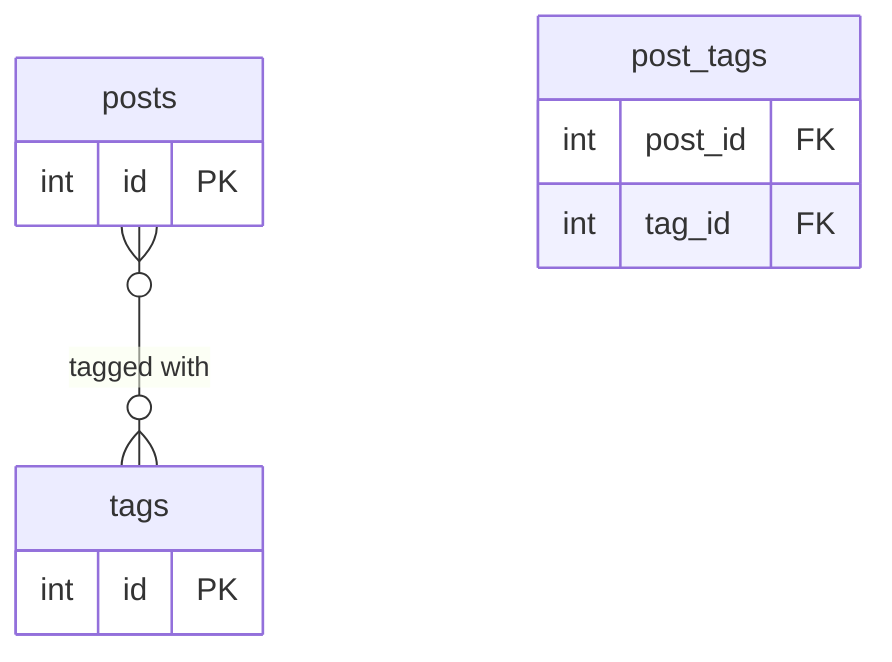
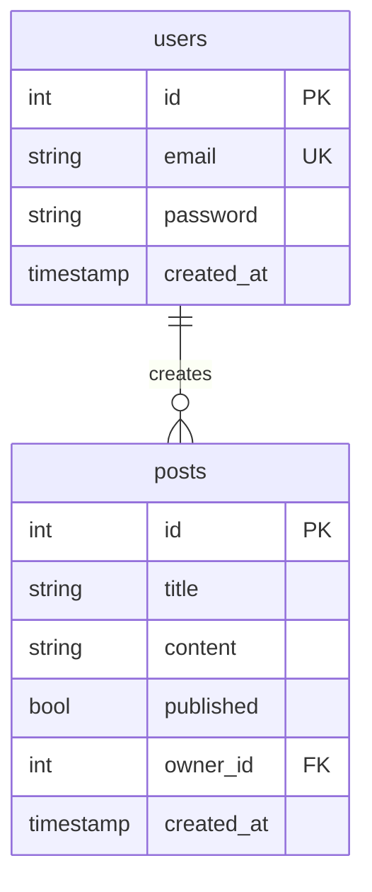

# Database Relationships

In a relational database, tables are linked to each other through **foreign keys**. SQLAlchemy mirrors these links
with a `ForeignKey` column and a `relationship()` attribute that lets you traverse the link in Python code.

1. [Types of database relationships](#1-types-of-database-relationships)
2. [The User → Posts relationship](#2-the-user--posts-relationship)
3. [Add the foreign key and relationship to the models](#3-add-the-foreign-key-and-relationship-to-the-models)
4. [Update the schemas](#4-update-the-schemas)
5. [Link posts to their owner on creation](#5-link-posts-to-their-owner-on-creation)
6. [Enforce ownership on update and delete](#6-enforce-ownership-on-update-and-delete)
7. [Full code](#7-full-code)

## 1. Types of database relationships

### One-to-one

One record in table A is related to exactly **one** record in table B.

**Example:** a user has exactly one profile.



### One-to-many

One record in table A is related to **many** records in table B. This is the most common relationship type.

**Example:** one user creates many posts.



### Many-to-many

Many records in table A are related to many records in table B through a **junction table**.

**Example:** a post can have many tags; a tag can belong to many posts.



## 2. The User → Posts relationship

In this project we implement a **one-to-many** relationship: one `User` creates many `Posts`. Each post records
who created it via an `owner_id` foreign key column.



This relationship also enables **ownership enforcement**: only the user who created a post may update or delete it.

## 3. Add the foreign key and relationship to the models

Update `app/models.py` to add:

- `owner_id` — a `ForeignKey` column on `Post` pointing to `users.id`
- `owner` — a SQLAlchemy `relationship` on `Post` that loads the related `User` object automatically
- `posts` — the reverse `relationship` on `User`

```python
from sqlalchemy import Boolean, Column, Integer, String, ForeignKey
from sqlalchemy.orm import relationship
from sqlalchemy.sql.expression import text
from sqlalchemy.sql.sqltypes import TIMESTAMP

from .database import Base


class Post(Base):
    __tablename__ = "posts"

    id = Column(Integer, primary_key=True, nullable=False)
    title = Column(String, nullable=False)
    content = Column(String, nullable=False)
    published = Column(Boolean, server_default='true', nullable=False)
    created_at = Column(TIMESTAMP(timezone=True), nullable=False, server_default=text('now()'))
    owner_id = Column(Integer, ForeignKey("users.id", ondelete="CASCADE"), nullable=False)
    owner = relationship("User", back_populates="posts")


class User(Base):
    __tablename__ = "users"

    id = Column(Integer, primary_key=True, nullable=False)
    email = Column(String, nullable=False, unique=True)
    password = Column(String, nullable=False)
    created_at = Column(TIMESTAMP(timezone=True), nullable=False, server_default=text('now()'))
    posts = relationship("Post", back_populates="owner")
```

**Key points:**

- `ForeignKey("users.id", ondelete="CASCADE")` — deleting a `User` automatically deletes all their `Post` rows.
- `relationship("User", back_populates="posts")` — SQLAlchemy lazy-loads the `User` object via `owner_id`.
  Access it in Python as `post.owner`.
- `back_populates` wires both sides together so `post.owner` and `user.posts` are kept in sync automatically.

> **Note:** Adding a non-nullable `owner_id` column to an existing `posts` table requires a database migration.
> For local development the simplest option is to drop the table and let SQLAlchemy recreate it:
>
> ```sql
> DROP TABLE posts;
> ```
>
> On the next server start `Base.metadata.create_all(bind=engine)` in `main.py` will recreate the table with the
> new column.

## 4. Update the schemas

The `Post` response schema needs two new fields so the API returns both the raw owner id and the nested owner object.

```python
class Post(PostBase):
    id: int
    created_at: datetime
    owner_id: int
    owner: UserOut
    model_config = ConfigDict(from_attributes=True)
```

**Key points:**

- `owner_id: int` — exposes the raw foreign-key value from the `posts` table.
- `owner: UserOut` — exposes the nested owner using the existing `UserOut` schema (`id`, `email`, `created_at`).
  SQLAlchemy's `relationship` populates this automatically because `from_attributes=True` is set.
- `UserOut` must be declared **before** `Post` in `schemas.py` because `Post` references it.

## 5. Link posts to their owner on creation

Update `create_post` in `app/routers/post.py` to stamp `owner_id` with the authenticated user's id.

```python
@router.post("/", status_code=status.HTTP_201_CREATED, response_model=schemas.Post)
def create_post(post: schemas.PostCreate, db: Session = Depends(get_db),
                current_user: int = Depends(oauth2.get_current_user)):
    new_post = models.Post(owner_id=current_user.id, **post.model_dump())
    db.add(new_post)
    db.commit()
    db.refresh(new_post)
    return new_post
```

**Key points:**

- `current_user` is the full `User` object returned by `get_current_user` (from `app/oauth2.py`).
- `owner_id=current_user.id` is passed explicitly and the remaining fields are unpacked from `post.model_dump()`.
  There is no conflict because `PostCreate.model_dump()` does not include `owner_id`.

## 6. Enforce ownership on update and delete

Only the post owner should be allowed to modify or remove a post. Add a `403 Forbidden` ownership check **after**
the `404` existence check in both `delete_post` and `update_post`.

**delete_post:**

```python
@router.delete("/{id}", status_code=status.HTTP_204_NO_CONTENT)
def delete_post(id: int, db: Session = Depends(get_db),
                current_user: int = Depends(oauth2.get_current_user)):
    post_query = db.query(models.Post).filter(models.Post.id == id)
    post = post_query.first()
    if post is None:
        raise HTTPException(status_code=status.HTTP_404_NOT_FOUND, detail=f"post with id: {id} was not found")
    if post.owner_id != current_user.id:
        raise HTTPException(status_code=status.HTTP_403_FORBIDDEN,
                            detail="Not authorized to perform requested action")
    post_query.delete(synchronize_session=False)
    db.commit()
    return Response(status_code=status.HTTP_204_NO_CONTENT)
```

**update_post:**

```python
@router.put("/{id}", response_model=schemas.Post)
def update_post(id: int, post: schemas.PostCreate, db: Session = Depends(get_db),
                current_user: int = Depends(oauth2.get_current_user)):
    post_query = db.query(models.Post).filter(models.Post.id == id)
    existing_post = post_query.first()
    if existing_post is None:
        raise HTTPException(status_code=status.HTTP_404_NOT_FOUND, detail=f"post with id: {id} was not found")
    if existing_post.owner_id != current_user.id:
        raise HTTPException(status_code=status.HTTP_403_FORBIDDEN,
                            detail="Not authorized to perform requested action")
    post_query.update(post.model_dump(), synchronize_session=False)
    db.commit()
    return post_query.first()
```

**Key points:**

- The ownership check must come **after** the existence check — you cannot read `post.owner_id` if `post` is `None`.
- Return `403 Forbidden` (not `404`) so the caller knows the resource exists but they lack permission.
- We store a reference to the query (`post_query`) and call `.first()` on it twice to avoid writing the filter twice.

## 7. Full code

The updated file architecture:

```text
app/
├── routers/
│   ├── auth.py         # Authentication router (POST /login)
│   ├── post.py         # Posts router (ownership-enforced write operations)
│   ├── user.py         # Users router
│   └── __init__.py
├── main.py             # Registers all routers
├── database.py         # Database connection
├── models.py           # SQLAlchemy models (Post → User FK + relationships)
├── oauth2.py           # JWT token logic and get_current_user dependency
├── schemas.py          # Pydantic schemas (Post now includes owner_id and owner)
└── utils.py            # Password hashing utilities
```

**models.py:**

```python
from sqlalchemy import Boolean, Column, Integer, String, ForeignKey
from sqlalchemy.orm import relationship
from sqlalchemy.sql.expression import text
from sqlalchemy.sql.sqltypes import TIMESTAMP

from .database import Base


class Post(Base):
    __tablename__ = "posts"

    id = Column(Integer, primary_key=True, nullable=False)
    title = Column(String, nullable=False)
    content = Column(String, nullable=False)
    published = Column(Boolean, server_default='true', nullable=False)
    created_at = Column(TIMESTAMP(timezone=True), nullable=False, server_default=text('now()'))
    owner_id = Column(Integer, ForeignKey("users.id", ondelete="CASCADE"), nullable=False)
    owner = relationship("User", back_populates="posts")


class User(Base):
    __tablename__ = "users"

    id = Column(Integer, primary_key=True, nullable=False)
    email = Column(String, nullable=False, unique=True)
    password = Column(String, nullable=False)
    created_at = Column(TIMESTAMP(timezone=True), nullable=False, server_default=text('now()'))
    posts = relationship("Post", back_populates="owner")
```

**schemas.py:**

```python
from typing import Optional
from pydantic import BaseModel, ConfigDict, EmailStr
from datetime import datetime


class PostBase(BaseModel):
    title: str
    content: str
    published: bool = True


class PostCreate(PostBase):
    pass


class UserCreate(BaseModel):
    email: EmailStr
    password: str


class UserOut(BaseModel):
    id: int
    email: EmailStr
    created_at: datetime
    model_config = ConfigDict(from_attributes=True)


class Post(PostBase):
    id: int
    created_at: datetime
    owner_id: int
    owner: UserOut
    model_config = ConfigDict(from_attributes=True)


class UserLogin(BaseModel):
    email: EmailStr
    password: str


class Token(BaseModel):
    access_token: str
    token_type: str


class TokenData(BaseModel):
    id: Optional[int] = None
```

**routers/post.py:**

```python
from fastapi import Depends, HTTPException, Response, status, APIRouter
from sqlalchemy.orm import Session

from app import models, schemas, oauth2
from app.database import get_db

router = APIRouter(
    prefix="/posts",
    tags=["Posts"]
)


@router.get("/", response_model=list[schemas.Post])
def get_posts(db: Session = Depends(get_db), current_user: int = Depends(oauth2.get_current_user)):
    posts = db.query(models.Post).all()
    return posts


@router.post("/", status_code=status.HTTP_201_CREATED, response_model=schemas.Post)
def create_post(post: schemas.PostCreate, db: Session = Depends(get_db),
                current_user: int = Depends(oauth2.get_current_user)):
    new_post = models.Post(owner_id=current_user.id, **post.model_dump())
    db.add(new_post)
    db.commit()
    db.refresh(new_post)
    return new_post


@router.get("/latest", response_model=schemas.Post)
def get_latest_post(db: Session = Depends(get_db),
                    current_user: int = Depends(oauth2.get_current_user)):
    latest_post = db.query(models.Post).order_by(models.Post.id.desc()).first()
    if latest_post is None:
        raise HTTPException(status_code=status.HTTP_404_NOT_FOUND, detail="No posts found")
    return latest_post


@router.get("/{id}", response_model=schemas.Post)
def get_post(id: int, db: Session = Depends(get_db),
             current_user: int = Depends(oauth2.get_current_user)):
    post = db.query(models.Post).filter(models.Post.id == id).first()
    if post is None:
        raise HTTPException(status_code=status.HTTP_404_NOT_FOUND, detail=f"post with id: {id} was not found")
    return post


@router.delete("/{id}", status_code=status.HTTP_204_NO_CONTENT)
def delete_post(id: int, db: Session = Depends(get_db),
                current_user: int = Depends(oauth2.get_current_user)):
    post_query = db.query(models.Post).filter(models.Post.id == id)
    post = post_query.first()
    if post is None:
        raise HTTPException(status_code=status.HTTP_404_NOT_FOUND, detail=f"post with id: {id} was not found")
    if post.owner_id != current_user.id:
        raise HTTPException(status_code=status.HTTP_403_FORBIDDEN,
                            detail="Not authorized to perform requested action")
    post_query.delete(synchronize_session=False)
    db.commit()
    return Response(status_code=status.HTTP_204_NO_CONTENT)


@router.put("/{id}", response_model=schemas.Post)
def update_post(id: int, post: schemas.PostCreate, db: Session = Depends(get_db),
                current_user: int = Depends(oauth2.get_current_user)):
    post_query = db.query(models.Post).filter(models.Post.id == id)
    existing_post = post_query.first()
    if existing_post is None:
        raise HTTPException(status_code=status.HTTP_404_NOT_FOUND, detail=f"post with id: {id} was not found")
    if existing_post.owner_id != current_user.id:
        raise HTTPException(status_code=status.HTTP_403_FORBIDDEN,
                            detail="Not authorized to perform requested action")
    post_query.update(post.model_dump(), synchronize_session=False)
    db.commit()
    return post_query.first()
```
