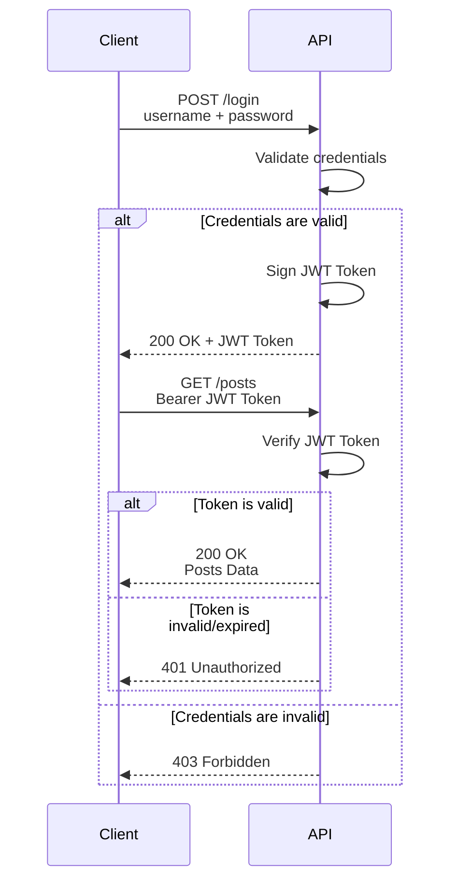

# JWT (JSON Web Token) Token Authentication

1. [About JWT token authentication](#1-about-jwt-token-authentication)
2. [What is a JWT token?](#2-what-is-a-jwt-token)
3. [Install the dependencies](#3-install-the-dependencies)
4. [Update the schemas](#4-update-the-schemas)
5. [Create the `auth` router](#5-create-the-auth-router)
6. [Create and configure the `oauth2` file](#6-create-and-configure-the-oauth2-file)
7. [Protect routes with JWT](#7-protect-routes-with-jwt)
8. [Full code](#8-full-code)

## 1. About JWT token authentication

JWT (JSON Web Token) token authentication is a way to authenticate users by issuing a token to the user after they
have successfully logged in. The token is then used to access the protected resources.



## 2. What is a JWT token?

A JWT token is a JSON object that is used to authenticate a user. It is a string issued by the server to the client
after the user has successfully logged in. The token is then used to access the protected resources.

A JWT token is made up of three parts separated by dots (`.`):

**Header** (algorithm & token type): Contains the algorithm used to sign the token.

```json
{
  "alg": "HS256",
  "typ": "JWT"
}
```

**Payload** (data): Contains the claims about the user. This is where we store the `user_id`.

```json
{
  "user_id": 19,
  "exp": 1759276800
}
```

**Signature** (verify signature): A hash of the header and payload signed with a secret key.

```text
HMACSHA256(
    base64UrlEncode(header) + "." +
    base64UrlEncode(payload),
    your-256-bit-secret
)
```

> **Important:** The payload is only _base64-encoded_, not encrypted. Never store sensitive data (e.g. passwords)
> inside a JWT token.

## 3. Install the dependencies

We use the `python-jose` library with the `cryptography` backend to encode and decode JWT tokens.

```bash
pip install "python-jose[cryptography]"
```

Because the project uses a virtual environment (`.venv`), and the `pip` shebang may be broken, install via the Python
binary directly:

```bash
.venv/bin/python3.12 -m pip install "python-jose[cryptography]"
```

## 4. Update the schemas

Add three new schemas to `app/schemas.py` to handle login input, the token response, and the token payload.

```python
from typing import Optional
from pydantic import BaseModel, ConfigDict, EmailStr
from datetime import datetime


# --- existing schemas (PostBase, PostCreate, Post, UserCreate, UserOut) ---


class UserLogin(BaseModel):
    email: EmailStr
    password: str


class Token(BaseModel):
    access_token: str
    token_type: str


class TokenData(BaseModel):
    id: Optional[int] = None
```

- `UserLogin` — validates the raw login request body (email + password).
- `Token` — the response shape returned to the client after a successful login.
- `TokenData` — holds the data extracted from a decoded JWT; `id` is `int` because the database primary key is an
  integer.

## 5. Create the `auth` router

Create `app/routers/auth.py`. This router exposes the `POST /login` endpoint.

```python
from fastapi import APIRouter, Depends, status, HTTPException
from fastapi.security.oauth2 import OAuth2PasswordRequestForm
from sqlalchemy.orm import Session
from .. import database, schemas, models, utils, oauth2

router = APIRouter(
    tags=["Authentication"]
)


@router.post("/login", response_model=schemas.Token)
def login(user_credentials: OAuth2PasswordRequestForm = Depends(), db: Session = Depends(database.get_db)):
    # OAuth2PasswordRequestForm validates the form and provides .username and .password
    # query the user from the database by email
    user = db.query(models.User).filter(models.User.email == user_credentials.username).first()
    # if the user is not found, raise a 403 error
    if not user:
        raise HTTPException(status_code=status.HTTP_403_FORBIDDEN, detail="Invalid Credentials")
    # verify the password against the stored hash — wrong password returns 404
    if not utils.verify(user_credentials.password, user.password):
        raise HTTPException(status_code=status.HTTP_404_NOT_FOUND, detail="Invalid Credentials")
    # create and return the access token
    access_token = oauth2.create_access_token(data={"user_id": user.id})
    return {"access_token": access_token, "token_type": "bearer"}
```

**Key points:**

- `OAuth2PasswordRequestForm` reads a standard `application/x-www-form-urlencoded` body with `username` and `password`
  fields. FastAPI's OAuth2 form uses `username` — we map it to the user's email.
- `response_model=schemas.Token` validates and serializes the response to the `Token` schema shape (`access_token` +
  `token_type`).
- No prefix is set on this router so the endpoint is exactly `POST /login`.
- Register this router in `main.py` (see section 8).

## 6. Create and configure the `oauth2` file

Create `app/oauth2.py`. This file contains the JWT configuration, token creation, token verification, and the
`get_current_user` dependency.

```python
from jose import jwt, JWTError
from sqlalchemy.orm import Session
from . import schemas, database, models
from datetime import datetime, timedelta, timezone
from fastapi import Depends, HTTPException, status
from fastapi.security import OAuth2PasswordBearer

oauth2_scheme = OAuth2PasswordBearer(tokenUrl="login")

# --- JWT configuration ---
SECRET_KEY = "09d25e094faa6ca2556c818166b7a9563b93f7099f6f0f40ad1f5701fe593c56"
ALGORITHM = "HS256"
ACCESS_TOKEN_EXPIRE_MINUTES = 60


def create_access_token(data: dict):
    to_encode = data.copy()
    expire = datetime.now(timezone.utc) + timedelta(minutes=ACCESS_TOKEN_EXPIRE_MINUTES)
    to_encode.update({"exp": expire})
    encoded_jwt = jwt.encode(to_encode, SECRET_KEY, algorithm=ALGORITHM)
    return encoded_jwt


def verify_access_token(token: str, credentials_exception):
    try:
        payload = jwt.decode(token, SECRET_KEY, algorithms=[ALGORITHM])
        id: int = payload.get("user_id")
        if not id:
            raise credentials_exception
        token_data = schemas.TokenData(id=id)
    except JWTError:
        raise credentials_exception
    return token_data


async def get_current_user(token: str = Depends(oauth2_scheme), db: Session = Depends(database.get_db)):
    credentials_exception = HTTPException(
        status_code=status.HTTP_401_UNAUTHORIZED,
        detail="Could not validate credentials",
        headers={"WWW-Authenticate": "Bearer"}
    )
    token_data = verify_access_token(token, credentials_exception)
    user = db.query(models.User).filter(models.User.id == token_data.id).first()
    if not user:
        raise credentials_exception
    return user
```

### Function breakdown

| Function              | Purpose                                                                                                                          |
|-----------------------|----------------------------------------------------------------------------------------------------------------------------------|
| `create_access_token` | Encodes the payload (user_id + expiry) into a signed JWT string                                                                  |
| `verify_access_token` | Decodes and validates the JWT; raises `credentials_exception` on failure                                                         |
| `get_current_user`    | FastAPI dependency — extracts the Bearer token, verifies it, queries the `User` from the database, and returns the `User` object |

### `OAuth2PasswordBearer`

`OAuth2PasswordBearer(tokenUrl="login")` tells FastAPI that the token is obtained from `POST /login`. It
automatically reads the `Authorization: Bearer <token>` header on protected routes.

## 7. Protect routes with JWT

Add `get_current_user` as a dependency to any route that requires authentication. In this project **every** `/posts`
route is protected — both reads and writes.

```python
from app import oauth2


@router.get("/", response_model=list[schemas.Post])
def get_posts(db: Session = Depends(get_db), current_user: int = Depends(oauth2.get_current_user)):
    posts = db.query(models.Post).all()
    return posts


@router.post("/", status_code=status.HTTP_201_CREATED, response_model=schemas.Post)
def create_post(post: schemas.PostCreate, db: Session = Depends(get_db),
                current_user: int = Depends(oauth2.get_current_user)):
    new_post = models.Post(**post.model_dump())
    db.add(new_post)
    db.commit()
    db.refresh(new_post)
    return new_post

# ... all remaining routes (latest, /{id}, delete, update) carry the same dependency
```

**Key points:**

- The dependency parameter is named `current_user` — `get_current_user` returns the full `User` database object, so
  any route handler can access `current_user.id`, `current_user.email`, etc.
- If the request does not include a valid Bearer token, FastAPI returns `401 Unauthorized` before the function body
  is ever reached.
- Apply the dependency to every route you want protected; omit it from public routes like `POST /users`.

## 8. Full code

The updated file architecture:

```text
app/
├── routers/
│   ├── auth.py         # Authentication router (POST /login)
│   ├── post.py         # Posts router (all routes JWT-protected)
│   ├── user.py         # Users router
│   └── __init__.py
├── main.py             # Registers all routers
├── database.py         # Database connection
├── models.py           # SQLAlchemy models
├── oauth2.py           # JWT token logic and get_current_user dependency
├── schemas.py          # Pydantic schemas (includes Token, TokenData)
└── utils.py            # Password hashing utilities
```

**main.py:**

```python
from fastapi import FastAPI

from . import models
from .database import engine
from .routers import user, post, auth

models.Base.metadata.create_all(bind=engine)

app = FastAPI()

app.include_router(user.router)
app.include_router(post.router)
app.include_router(auth.router)
```

**oauth2.py:**

```python
from jose import jwt, JWTError
from sqlalchemy.orm import Session
from . import schemas, database, models
from datetime import datetime, timedelta, timezone
from fastapi import Depends, HTTPException, status
from fastapi.security import OAuth2PasswordBearer

oauth2_scheme = OAuth2PasswordBearer(tokenUrl="login")

SECRET_KEY = "09d25e094faa6ca2556c818166b7a9563b93f7099f6f0f40ad1f5701fe593c56"
ALGORITHM = "HS256"
ACCESS_TOKEN_EXPIRE_MINUTES = 60


def create_access_token(data: dict):
    to_encode = data.copy()
    expire = datetime.now(timezone.utc) + timedelta(minutes=ACCESS_TOKEN_EXPIRE_MINUTES)
    to_encode.update({"exp": expire})
    encoded_jwt = jwt.encode(to_encode, SECRET_KEY, algorithm=ALGORITHM)
    return encoded_jwt


def verify_access_token(token: str, credentials_exception):
    try:
        payload = jwt.decode(token, SECRET_KEY, algorithms=[ALGORITHM])
        id: int = payload.get("user_id")
        if not id:
            raise credentials_exception
        token_data = schemas.TokenData(id=id)
    except JWTError:
        raise credentials_exception
    return token_data


async def get_current_user(token: str = Depends(oauth2_scheme), db: Session = Depends(database.get_db)):
    credentials_exception = HTTPException(
        status_code=status.HTTP_401_UNAUTHORIZED,
        detail="Could not validate credentials",
        headers={"WWW-Authenticate": "Bearer"}
    )
    token_data = verify_access_token(token, credentials_exception)
    user = db.query(models.User).filter(models.User.id == token_data.id).first()
    if not user:
        raise credentials_exception
    return user
```

**routers/auth.py:**

```python
from fastapi import APIRouter, Depends, status, HTTPException
from fastapi.security.oauth2 import OAuth2PasswordRequestForm
from sqlalchemy.orm import Session
from .. import database, schemas, models, utils, oauth2

router = APIRouter(
    tags=["Authentication"]
)


@router.post("/login", response_model=schemas.Token)
def login(user_credentials: OAuth2PasswordRequestForm = Depends(), db: Session = Depends(database.get_db)):
    user = db.query(models.User).filter(models.User.email == user_credentials.username).first()
    if not user:
        raise HTTPException(status_code=status.HTTP_403_FORBIDDEN, detail="Invalid Credentials")
    if not utils.verify(user_credentials.password, user.password):
        raise HTTPException(status_code=status.HTTP_404_NOT_FOUND, detail="Invalid Credentials")
    access_token = oauth2.create_access_token(data={"user_id": user.id})
    return {"access_token": access_token, "token_type": "bearer"}
```

**schemas.py:**

```python
from typing import Optional
from pydantic import BaseModel, ConfigDict, EmailStr
from datetime import datetime


class PostBase(BaseModel):
    title: str
    content: str
    published: bool = True


class PostCreate(PostBase):
    pass


class Post(PostBase):
    id: int
    created_at: datetime
    model_config = ConfigDict(from_attributes=True)


class UserCreate(BaseModel):
    email: EmailStr
    password: str


class UserOut(BaseModel):
    id: int
    email: EmailStr
    created_at: datetime
    model_config = ConfigDict(from_attributes=True)


class UserLogin(BaseModel):
    email: EmailStr
    password: str


class Token(BaseModel):
    access_token: str
    token_type: str


class TokenData(BaseModel):
    id: Optional[int] = None
```

**routers/post.py (all routes JWT-protected):**

```python
from fastapi import Depends, HTTPException, Response, status, APIRouter
from sqlalchemy.orm import Session

from app import models, schemas, oauth2
from app.database import get_db

router = APIRouter(
    prefix="/posts",
    tags=["Posts"]
)


@router.get("/", response_model=list[schemas.Post])
def get_posts(db: Session = Depends(get_db), current_user: int = Depends(oauth2.get_current_user)):
    posts = db.query(models.Post).all()
    return posts


@router.post("/", status_code=status.HTTP_201_CREATED, response_model=schemas.Post)
def create_post(post: schemas.PostCreate, db: Session = Depends(get_db),
                current_user: int = Depends(oauth2.get_current_user)):
    new_post = models.Post(**post.model_dump())
    db.add(new_post)
    db.commit()
    db.refresh(new_post)
    return new_post


@router.get("/latest", response_model=schemas.Post)
def get_latest_post(db: Session = Depends(get_db),
                    current_user: int = Depends(oauth2.get_current_user)):
    latest_post = db.query(models.Post).order_by(models.Post.id.desc()).first()
    if latest_post is None:
        raise HTTPException(status_code=status.HTTP_404_NOT_FOUND, detail="No posts found")
    return latest_post


@router.get("/{id}", response_model=schemas.Post)
def get_post(id: int, db: Session = Depends(get_db),
             current_user: int = Depends(oauth2.get_current_user)):
    post = db.query(models.Post).filter(models.Post.id == id).first()
    if post is None:
        raise HTTPException(status_code=status.HTTP_404_NOT_FOUND, detail=f"post with id: {id} was not found")
    return post


@router.delete("/{id}", status_code=status.HTTP_204_NO_CONTENT)
def delete_post(id: int, db: Session = Depends(get_db),
                current_user: int = Depends(oauth2.get_current_user)):
    deleted_post = db.query(models.Post).filter(models.Post.id == id).delete(synchronize_session=False)
    if deleted_post == 0:
        raise HTTPException(status_code=status.HTTP_404_NOT_FOUND, detail=f"post with id: {id} was not found")
    db.commit()
    return Response(status_code=status.HTTP_204_NO_CONTENT)


@router.put("/{id}", response_model=schemas.Post)
def update_post(id: int, post: schemas.PostCreate, db: Session = Depends(get_db),
                current_user: int = Depends(oauth2.get_current_user)):
    post_query = db.query(models.Post).filter(models.Post.id == id)
    if post_query.first() is None:
        raise HTTPException(status_code=status.HTTP_404_NOT_FOUND, detail=f"post with id: {id} was not found")
    post_query.update(post.model_dump(), synchronize_session=False)
    db.commit()
    return post_query.first()
```
