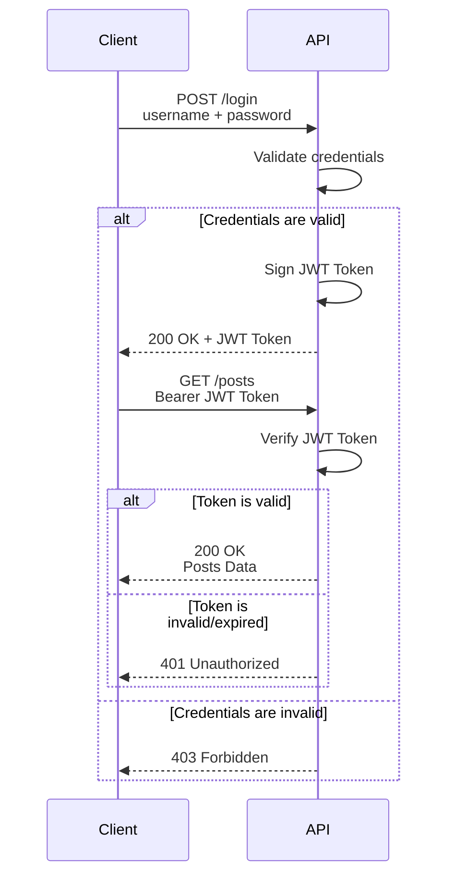

# JWT (JSON Web Token) token authentication

1. About JWT token authentication
2. What is a JWT token?
3. Install the dependencies

## 1. About JWT token authentication

JWT (JSON Web Token) token authentication is a way to authenticate users by issuing a token to the user after they have successfully logged in. The token is then used to access the protected resources.



## 2.  What is a JWT token?

A JWT token is a JSON object that is used to authenticate a user. It is a string that is issued by the server to the client after the user has successfully logged in. The token is then used to access the protected resources.

The JWT token is a JSON object that contains the following information:

- Header (algorithm & token type): The header contains the algorithm used to sign the token.

```json
{
    "alg": "HS256",
    "typ": "JWT"
}
```

- Payload (data): The payload contains the claims about the user.

```json
{
    "sub": "1234567890",
    "name": "John Doe",
    "iat": 1516239022
}
```

- Signature (Verify signature): The signature is the hash of the header and payload.

```json
HMACSHA256(
    base64UrlEncode(header) + "." +
    base64UrlEncode(payload),
    your-256-bit-secret
)
```

## 3. Install the dependencies

We will use the `pyjwt` library to generate and verify the JWT tokens.

```bash
pip install pyjwt
```
